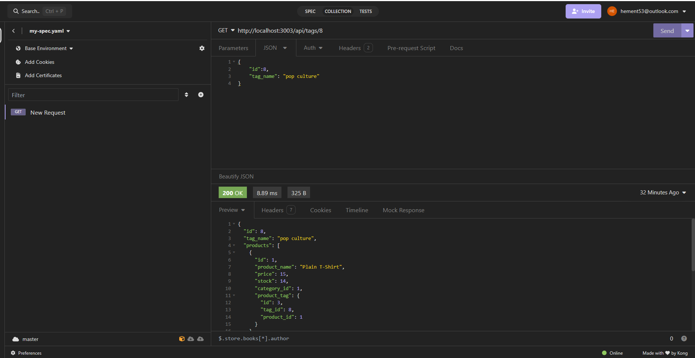
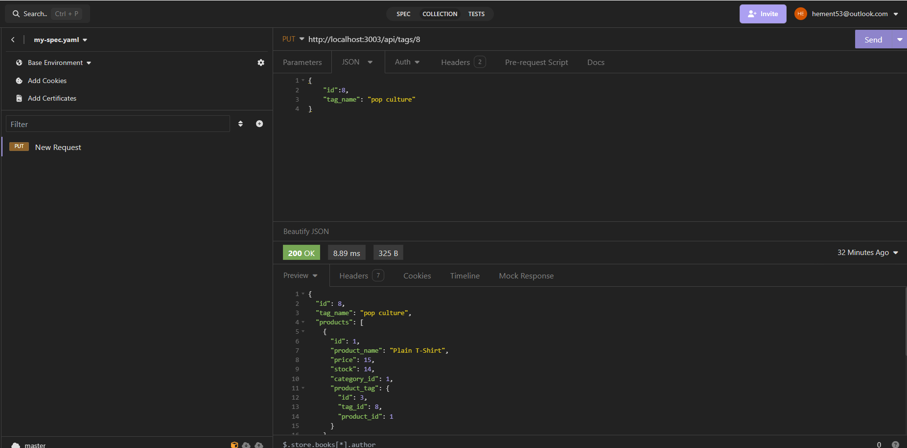
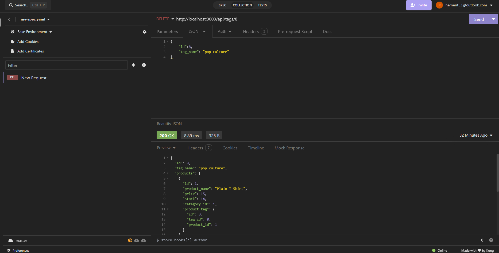

# E-Commerce-Back-End
Object-Relational Mapping (ORM)

## Overview
Welcome to Object Relational Mapping (ORM) E-Commerce Back End! This project is designed to serve as the database backbone for e-commerce websites, leveraging Express.js API and Sequelize to connect seamlessly with MySQL databases. With this back end, users can effortlessly create development databases, populate them with test data, and synchronize Sequelize models with MySQL databases. The API offers various routes for GET, POST, PUT, and DELETE operations, empowering users to efficiently manage and manipulate data in their databases.

## Features
> Seamless Database Management: Easily create, seed, and sync development databases with test data.

> Powerful API Routes: Utilize GET, POST, PUT, and DELETE routes to interact with data in the database.

> Comprehensive Documentation: Detailed instructions and usage guidelines to facilitate smooth operation.

## Usage Information
 To make the most of this back end, follow these steps:

1. Clone the Repository: Clone the repository from GitHub or download the zip folder.
2. Install Dependencies: Open the repository in your preferred source code editor and install dependencies using npm.
3. Database Setup: Create a development database using the schema.sql file in the db folder and update environment variables with MySQL credentials.
4. Data Seeding: Seed the database with test data by running 'npm run seed'.
5. Server Startup: Start the server and sync Sequelize models with the MySQL database using 'npm start' or 'nodemon'.
6. API Testing: Use tools like Insomnia to test the API endpoints for categories, products, and tags, ensuring successful data manipulation.

## Built With
Express.js: A fast, unopinionated, minimalist web framework for Node.js.
Sequelize: An easy-to-use multi SQL dialect ORM for Node.js.
MySQL: A popular open-source relational database management system.
Insomnia: A powerful HTTP and REST client for testing APIs.

## GitHub Repository
https://github.com/hementB2/E-Commerce-Back-End

## YouTube Walkthrough Videos
https://drive.google.com/file/d/1j6Fvhf-aJF2QmepPy7LL3RckpN5i2KmC/view

## Deployed Application Link
https://github.com/hementB2/E-Commerce-Back-End

## Screenshots and GIFs
For a visual demonstration of the project's functionality, refer to the provided screenshots and GIFs.

